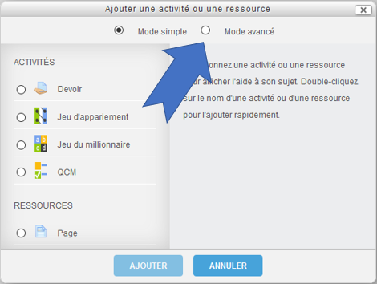
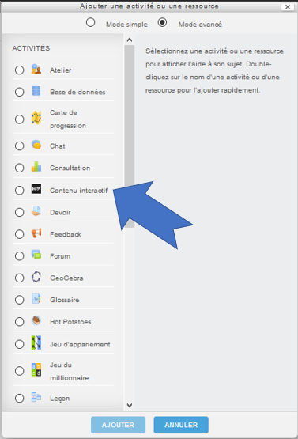
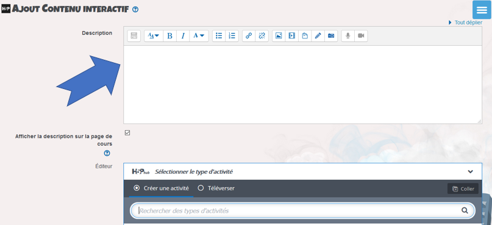
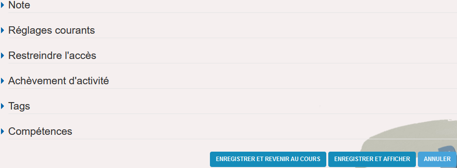

# Créer un contenu interactif

Le module "**Contenu Interactif (H5P)**" permet d'accéder à une collection d'activités diverses, pouvant mêler textes, images, vidéos et sons, et offrant toute une gamme d'interactions variées entre l'élève et les contenus créés. 

L'élève recevra des rétroactions selon ses résultats. Résultats qui seront automatiquement reportés dans le carnet de notes de la plateforme Éléa.

## Ajouter le contenu interactif

1. Activez le mode édition dans votre parcours en cliquant sur ce bouton en haut à droite ;

2. Dans la section souhaitée, cliquez sur "**Ajouter une activité ou une ressource**" ;

3. Dans cette fenêtre surgissante, cliquez sur "**Mode avancé**" ;

4. Puis sélectionnez "**H5P - Contenu Interactif**" ;

5. Cliquez enfin sur "**Ajouter**".

## Sélectionner l'activité souhaitée

Commencez par saisir une rapide description de l'activité qui va être créée.

Il y a ensuite **quatre** manières différentes d'accéder au type d'activité souhaité dans la section "**Éditeur**".

Au choix (voir numéro correspondant sur illustration) :

1. Si vous connaissez déjà le nom (en anglais) du type d'activité cherché saisissez le directement dans la barre de recherche ; après avoir frappé "**Entrée**" cette activité apparaîtra directement en haut de liste.

2. Cliquez sur "**Utilisés récemment en premier**". Tous les contenus interactifs disponibles seront listés en fonction de votre dernière date d'utilisation de chacun entre eux.

3. La collection H5P de contenus interactifs s'enrichit régulièrement de nouvelles activités. Cliquez sur "**Plus récents en premier**" et tous les contenus interactifs disponibles seront listés en fonction de leur date de parution.

4. Cliquez sur "**A à Z**" et tous les contenus interactifs disponibles seront listés par ordre alphabétique (dénominations en anglais).

   

   Cliquez enfin sur le bandeau de cette activité pour la créer.

## Créer l'activité

Selon le type d'activité élaborée, vous pouvez consulter sur la plateforme Éléa le tutoriel correspondant qui vous détaillera pas à pas la démarche à suivre.

Pour tester votre contenu interactif, cliquez en bas de page sur "**Enregistrer et afficher**".

**Remarque** : en option, une fois l'activité terminée, il est encore possible en bas de page, comme pour toute autre activité créée sur la plateforme Éléa, de fixer divers paramètres de notation, d'accès et d'achèvement pour cette activité.