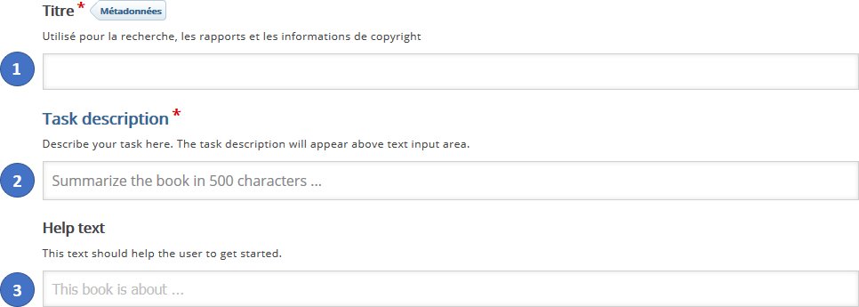
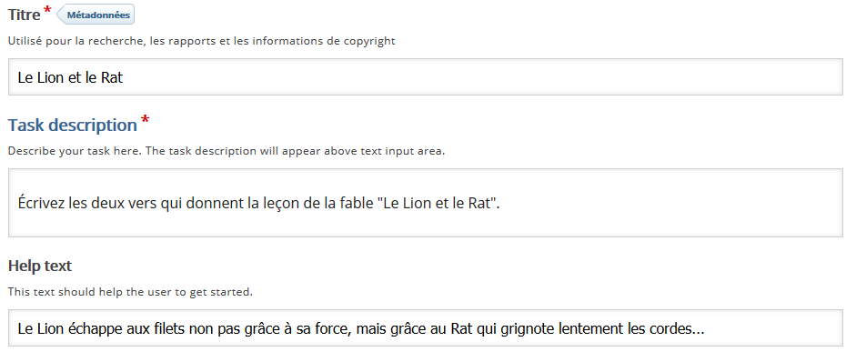
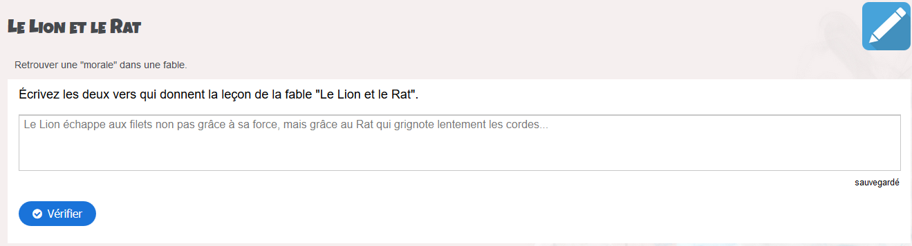
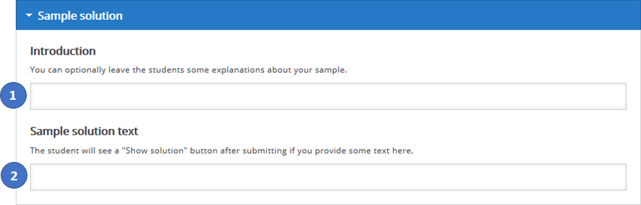
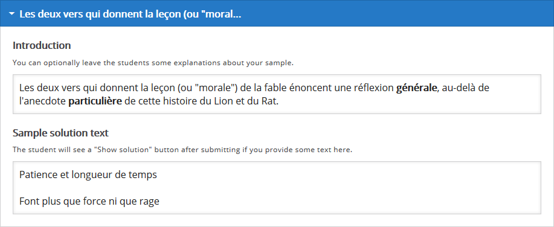
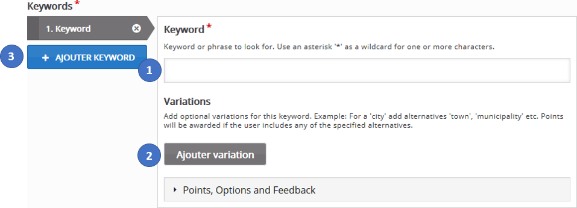
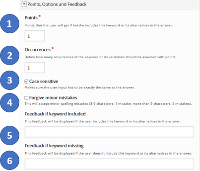
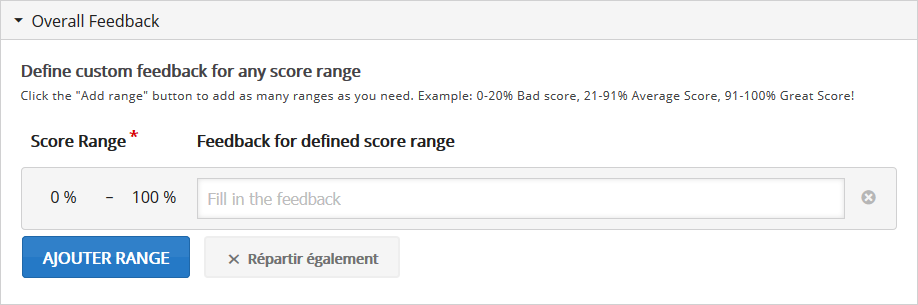
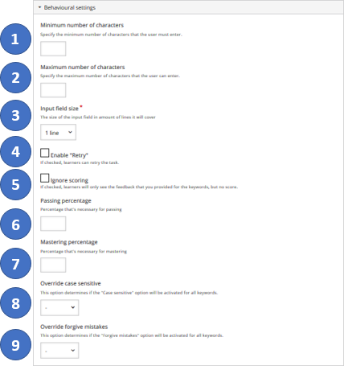

## Créer la consigne

1. Donnez un titre à l'activité. C'est sous ce titre que cette activité s'affichera dans le parcours Éléa.

2. Rédigez la consigne pour les élèves. 

**Exemple** : "Écrivez les vers qui donnent la leçon de la fable "Le Lion et le Rat"."

3. Vous pouvez proposer ici un conseil. Il s'agit ici éventuellement d'offrir aux élèves une suggestion, un canevas, pour amorcer leur propre rédaction. Ce texte vient donc compléter la consigne précédente : il apparaitra en filigrane dans l'éditeur de texte où les élèves rédigeront leurs réponses (et ce texte s'effacera automatiquement dès que l'élève commencera à saisir sa réponse).

   Du point de vue de l'enseignant :

   

   L'affichage qui en résultera pour l'élève : 

   

## Un exemple de solution (optionnel)

Après avoir saisit sa réponse et cliqué sur le bouton "**Vérifier**", un bouton "**Solution**" permettra à l'élève de lire la solution (ou un exemple de solution).

1. Rédigez ici quelques commentaires sur le travail attendu (conseils de méthode, exemples, plan général à suivre dans la rédaction, etc.)

2. Écrivez ici un exemple d'une rédaction correcte.

   

**Remarque** : pour votre confort de travail vous pouvez replier cet exemple de solution en cliquant sur la flèche blanche ▼ de la barre de titre (il sera possible plus tard de redéplier cet exemple pour le modifier en cliquant sur la flèche ►)

## Correction (partielle) automatisée : définir des mots-clefs

Avec l'activité "**Essai**" l'élève fournit sa réponse sous forme d'un texte "libre" : il est impossible d'offrir une correction automatisée exhaustive pour ce type de question ouverte. Une correction "partielle" consistera à détecter dans le texte rédigé par l'élève la présence ou non de certains **mots-clefs** prédéfinis par l'enseignant.

1. Saisissez un premier **mot-clef**, ou une expression, voire une phrase complète. Il s'agit là d'un élément textuel qui sera recherché à l'identique dans le texte de l'élève pour décompter son score final.

2. Cliquez autant de fois que souhaité sur "**Ajouter variation**" pour pouvoir entrer des énoncés alternatifs qui sont tout aussi corrects que le **mot-clef** précédemment saisi (il peut s'agit par exemple de synonymes du **mot-clef**, d'expressions équivalentes, etc.).

3. Cliquez ici pour renseigner chaque autre **mot-clef** qui devra être détecté dans la réponse de l'élève.

>**Remarque** :  dans le cas où le **mot-clef** est toute une phrase, il est recommandé de privilégier une phrase **courte** qui n'offre pas, ou peu, d'énoncés alternatifs possibles car la correction consiste à rechercher dans le texte de l'élève si cette phrase apparaît **telle quelle** ; caractère par caractère **exactement** (une phrase trop longue offrira souvent plusieurs formulations voisines qui devraient donc toutes être prises en compte comme autant d'alternatives correctes). 

>Une phrase que l'élève doit réciter après l'avoir apprise "par cœur" mettons, ou une phrase relevée telle quelle dans un document fourni aux élèves, seront en revanche bien adaptées ici (puisqu'en ce cas n'est attendu qu'un seul énoncé correct, **mot à mot**).

>L'activité "**Essai**" peut aussi utilisée comme un entrainement à la rédaction : l'élève rédige, puis reçoit des rétroactions adaptées, selon qu'il a bien inclus ou non certains éléments attendus (**mots-clefs**) dans son texte ; l'élève consigne ensuite par ailleurs son travail final (fiche de travail à compléter, document à déposer en ligne).

Il est possible de modifier dans la liste l'ordre des **mots-clefs** entre eux, en cliquant sur les flèches ▲ et ▼ dans leur barre de titre (cet ordre est sans incidence sur la correction qui en résultera).

Pour supprimer définitivement un **mot-clef** cliquez sur la croix **x**.

## Paramétrage des mots-clefs.

Cliquez sur "**Points,Options et Feedback**" ▼.

1. Renseignez ici le nombre de points accordés à l'élève si ce **mot-clef** (ou l'une de ses éventuelles variantes) apparait dans sa réponse.
2. Si un **mot-clef** doit être mentionné à plusieurs reprises dans le texte attendu de l'élève, indiquez ici le nombre **minimum** d'occurrences attendues pour que les points prévus pour ce **mot-clef** soient effectivement attribués à l'élève. 
3. Cochez cette case pour que la casse des caractères (majuscules/minuscules) soit ou non prise en compte lors de la correction.
4. Ce paramétrage permet d'ignorer pour partie d'éventuelles fautes de frappes : en cochant cette case, pour un **mot-clef** de 3 à 9 caractères, une faute de frappe sera tolérée ; pour un **mot-clef** de plus de 9 caractères, la tolérance sera de deux fautes de frappe.
5. Rédigez ici la rétroaction reçue par l'élève **s'il a** bien inclus le **mot-clef** indiqué.
6. Rédigez ici la rétroaction reçue en revanche par l'élève **s'il n'a pas** inclus le **mot-clef** indiqué.

L'activité est prête : vous pouvez cliquer en bas de page sur "**Enregistrer et afficher**" pour la tester.

## Rédiger des rétroactions

Rétroaction par paliers : En cliquant sur "**Feedback général**" il est possible de rédiger des rétroactions qui s'afficheront à la fin de l'activité en fonction du score de l'élève. Par défaut une seule rétroaction est disponible qui s'affichera pour tous les scores pouvant être obtenus de 0% (aucune bonne réponse) à 100% (réussite complète). Cliquez sur "**Ajouter Intervalle**" autant de fois que souhaité pour indiquer de nouvelles valeurs de score qui viendront subdiviser cet intervalle initial couvrant de 0% à 100%. Pour chacune des nouvelles valeurs saisies entre 0 et 100, il sera alors possible de rédiger une rétroaction adaptée. Selon que le score obtenu sera en-deçà ou au-delà de cette valeur donnée(en %), c'est l'une ou autre de ces rétroactions qui s'affichera pour commenter le travail de l'élève au terme de l'activité.

## Options (Behavourial Settings)

1. Indiquez le nombre **minimum** de caractères devant être saisis par l'élève avant qu'il puisse cliquer sur "**Vérifier**".
2. Indiquez le nombre **maximum** de caractères pouvant être saisis par l'élève dans sa réponse.
3. Ce paramétrage fixe en **nombre de lignes** disponibles les dimensions du champ de saisi de la réponse de l'élève (1, 3 ou 10 lignes de texte).
4. Selon que cette case est cochée ou non, le bouton "**Recommencer**" sera ou pas affiché.
5. Selon que cette case est cochée ou non, l'élève verra son score s'afficher ou pas.
6. On fixe ici un score minimal à atteindre pour que l'activité soit considérée comme achevée.
7. On fixe ici un score minimal à atteindre pour que l'activité soit considérée comme maîtrisée par l'élève.
8. Il s'agit d'un réglage global : on peut ici indiquer pour tous les **mots-clefs** d'un coup si la casse des caractères doit être prise en compte (enabled) ou non (disabled ; dans ce cas, on choisira pour chaque **mot-clef** séparément si la casse des caractères est prise en compte ou non).
9. Il s'agit d'un réglage global : on peut ici indiquer pour tous les **mots-clefs** d'un coup si la tolérance pour les fautes de frappe doit être prise en compte (enabled) ou non (disabled ; dans ce cas, on choisira pour chaque **mot-clef** séparément si a tolérance pour les fautes de frappe est prise en compte ou non).
