## Créer l'arrière-plan de l'activité

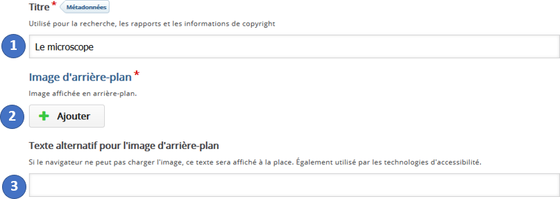

1. Donnez un titre à l'activité. C'est sous ce titre que cette activité s'affichera dans le parcours Éléa.

2. **Image d'arrière-plan** : cliquez sur le bouton "**+ Ajouter**". Puis parcourez les dossiers de votre ordinateur pour y sélectionner le fichier image souhaité. C'est sur cette image que reposera toute l'activité, en fournissant en arrière-plan à l'élève, les différents éléments au-dessus desquels viendront se positionner des puces cliquables - puces qui permettront d'accéder aux informations prévues.

Par défaut l'image occupera la plus grande largeur possible dans le fenêtre qui inclura l'infographie finale : aussi il convient de choisir convenablement cette image d'arrière-plan, tant en dimension qu'en résolution.

On pourra aussi vouloir réfléchir par avance aux éventuels espaces à ménager dans l'image afin que les puces cliquables, qui seront par la suite ajoutées à l'infographie au-dessus de cette image, ne viennent pas en masquer des éléments essentiels.

3. Rédigez un **Texte alternatif**  : ce texte se substituera à l'image si celle-ci rencontre un quelconque problème d'affichage quand l'activité est consultée. Ce libellé sera également lu par les outils de synthèse vocale améliorant l'accessibilité de cette ressource.

L'image ajoutée à l'activité peut être supprimée (pour par exemple lui en substituer une autre) avec l'icone croix **x** en haut à droite.

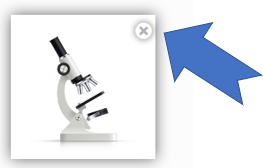

Sous l'image ajoutée à l'activité un menu **Éditer l'image** apparaît : il permet de rogner l'image ou de la pivoter quart de tour par quart de tour.

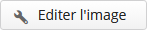

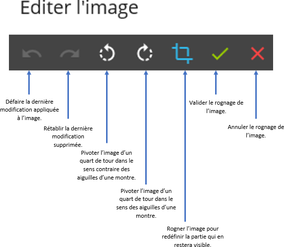

Enregistrez enfin les modifications appliquées à l'image.

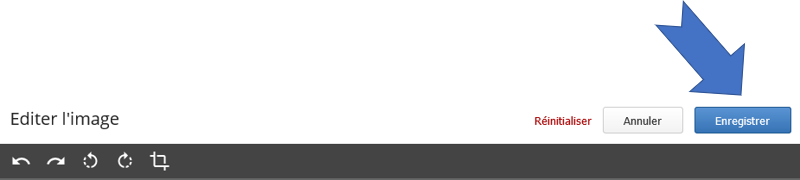

**Remarque** : un bouton copyright permet de renseigner les crédits et droits d'usage de l'image. Pour un rappel des principales licences en vigueur [cliquez ici](http://creativecommons.fr/licences/).

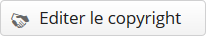

## Définir le type de puces de l'infographie

Toutes les puces de l'infographie si elles donnent accès à des informations différentes auront en revanche un seul et même aspect commun.

Il y a deux possibilités : 

- soit utiliser des puces prédéfinies.
- ou bien téléverser un modèle de puces personnalisé.

Dans le cas des puces prédéfinies, il s'agira d'en choisir la forme parmi celles proposées (**+**, **-**, **x**,**?**, **!**, etc.) ainsi que leur couleur (soit en cliquant dans la palette de couleur après en avoir ajusté la coloration générale en jouant sur le curseur du nuancier vertical, ou bien, s'il est déjà connu, en saisissant directement le code hexadécimal d'une couleur donnée).

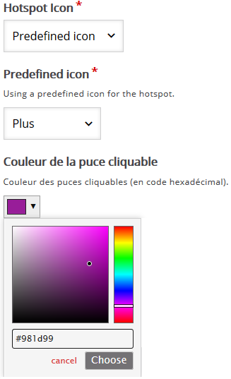

Dans le cas où l'on choisit de téléverser une image pour définir un type de puce personnalisé, après avoir cliqué sur "**+ Ajouter**" et téléversé le fichier image souhaité,  il est également possible d'éditer cette image sur le même modèle que précédemment pour l'image d'arrière-plan.

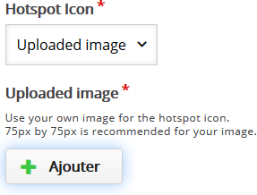

## Créer une première puce

La création d'une puce cliquable effectue en deux temps :

- positionnement de cette puce au-dessus de l'image d'arrière-plan.
- puis création du contenu qui s'affichera dans la fenêtre surgissante (ou "pop-up") qui apparaitra lorsque l'élève cliquera sur cette puce.

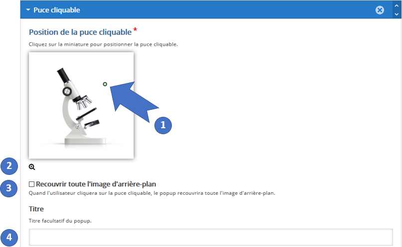

1. La puce est temporairement figurée par un **disque vert** : positionnez cette puce par cliquer-glisser vers l'endroit souhaité. Le but est ici d'établir une cohérence visuelle entre le contenu que révèlera cette puce et l'image d'arrière-plan.

2. En cliquant sur l'icone loupe **+** ou **-**, il est possible de zoomer/dézoomer dans l'image pour un positionnement plus précis de la puce cliquable.

3. En cochant cette option, la fenêtre surgissante qui apparaitra lorsqu'on cliquera sur cette puce recouvrira l'intégralité de l'espace de la ressource (dissimulant de ce fait temporairement l'image d'arrière-plan). 

On peut donc choisir ici, soit de focaliser l'attention de l'élève sur le seul contenu d'une puce cliquable à la fois (option cochée), ou bien, d'offrir la possibilité de mettre en relation le contenu informatif de cette puce cliquable avec l'image d'arrière-plan encore partiellement visible (option décochée).

4. Renseignez ici un titre pour cette puce (optionnel).

Le contenu de la fenêtre surgissante associée à une puce cliquable peut être de trois types :
- texte
- vidéo
- image (voir ci-dessus : la procédure en ce cas est identique à celle de la création de l'image d'arrière-plan ou d'une puce personnalisée)

**Attention** : il sera possible d'empiler les unes sous les autres plusieurs informations de ces trois différents types dans une seule et même fenêtre surgissante (voir infra : "**Organiser les contenus et les puces**").

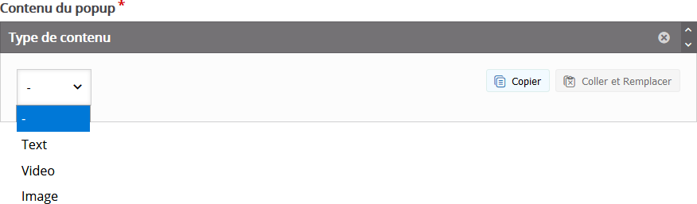

**Remarque** : à tout moment sélectionner dans ce menu déroulant le tiret **-** revient à supprimer le contenu éventuellement déjà créé ici.

## Créer un contenu texte

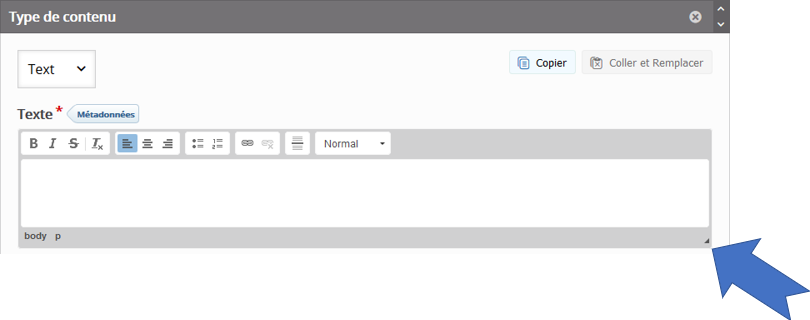

En sélectionnant "**Texte**" s'ouvre un éditeur de texte. 

Saisissez ici le contenu de ce premier item de la fenêtre surgissante. 

Vous disposez dans la barre supérieure des outils usuels d'un éditeur de texte : mise en gras ou en italique, dispositions centré, à droite ou à gauche des paragraphes, insertion/suppression de liens hypertextes ou de lignes horizontales de séparation, choix des styles et tailles de polices de caractères, ainsi que des couleurs d'écriture ou de fond.

**Remarque** : cliquez-tirez sur la flèche en bas à droite de l'éditeur de texte permet de le redimensionner pour un meilleur confort de travail.

## Créer un contenu vidéo

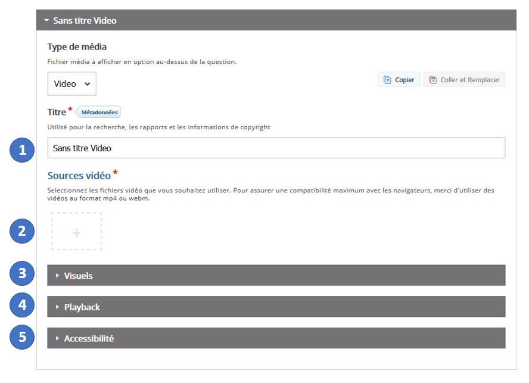

1. Indiquez un titre pour la vidéo choisie.
2. Cliquez sur le signe **+** pour explorer vos fichiers et y sélectionner le fichier vidéo à déposer. Alternativement, vous pouvez aussi entrer directement l'adresse (url) d'une vidéo hébergée en ligne. Cliquez ensuite sur "**Insérer**".
3. Ce menu permet selon les options cochées :
   - d'insérer une image qui se substituera à la vidéo hors lecture.
   - de définir si le lecteur vidéo occupera la plus grande largeur possible dans la page où il s'affichera, ou s'il s'adaptera aux dimensions de la vidéo diffusée.
   - de choisir si les contrôles de lecture, pause et arrêt apparaîtront ou non.
4. La lecture peut démarrer automatiquement au chargement du lecteur et/ou boucler une fois arrivée en fin de vidéo, selon les options cochées dans ce menu.
5. Vous pouvez enfin déposer ici un fichier de sous-titres pour améliorer l'accessibilité de votre contenu vidéo. Ce fichier de sous-titres doit être au format WebVTT (pour en apprendre davantage sur ce format de fichier <a href="https://fr.wikipedia.org/wiki/WebVTT" target="__blank">cliquez ici</a>).

  ## Organiser les contenus et les puces 

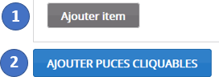

1. Il est possible d'afficher au sein d'une seule et même fenêtre surgissante déclenchée par une puce cliquable plusieurs contenus (texte, vidéo et image) qui seront empilés les uns au-dessus des autres. Cliquez sur "**Ajouter item**" pour ajouter du contenu supplémentaire à une fenêtre surgissante donnée.
2. Cliquez sur "**AJOUTER PUCES CLIQUABLES**" pour passer à la création de la puce cliquable suivante de l'infographie.

À tout moment il est possible au sein d'une même fenêtre surgissante de modifier l'ordre d'affichage de bas en haut des items d'informations qu'elle contient.

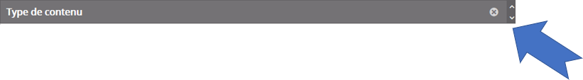

Utilisez les flèches, situées à droite de la barre grise du titre de l'item que vous souhaitez déplacer, pour le monter ▲ ou le descendre ▼ par rapport aux autres items de la même fenêtre.

Cliquez sur la croix **x** pour supprimer un item donné.

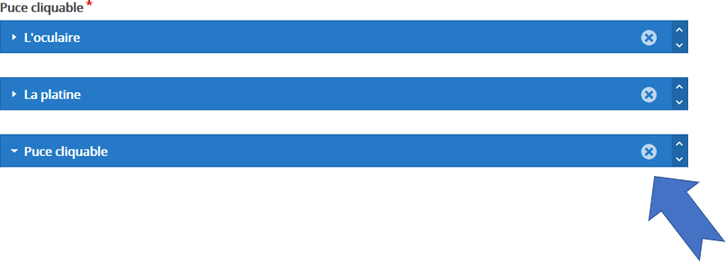

Lors de la création des puces cliquables, pour votre confort de lecture à l'écran, il vous est possible de condenser les informations (titre et contenus) d'une puce donnée en cliquant sur la flèche blanche **▼** qui est située à droite de sa barre bleue de titre. Ultérieurement, cliquez sur la flèche ► pour redéplier les informations de cette puce afin de pouvoir à nouveau les modifier.

L'ordre des puces cliquables peuvent être modifié : chaque puce peut être montée dans la liste en cliquant à droite de sa barre bleue de titre sur **▲**, ou descendue en cliquant sur **▼** (ceci ne modifie pas son positionnement dans l'infographie finale).

Cliquez sur la croix **x** pour supprimer entièrement une puce donnée.

Votre infographie est prête : vous pouvez cliquer en bas de page sur "**ENREGISTRER ET AFFICHER**" pour la consulter.

(crédits image : macrovector pour freepik.com ; crédit texte : Wikipedia)