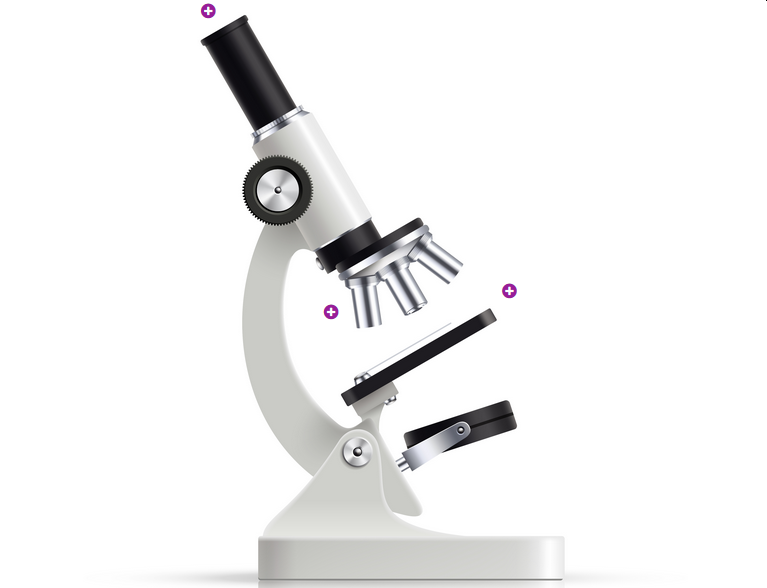
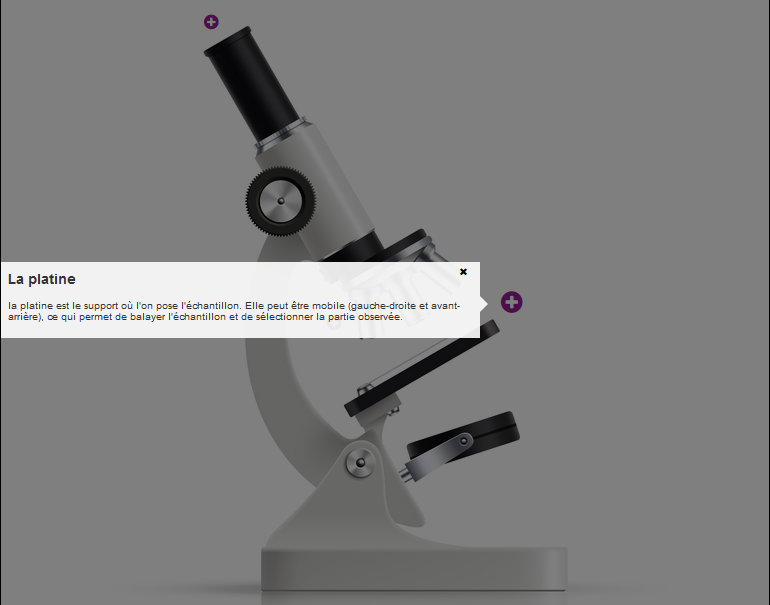
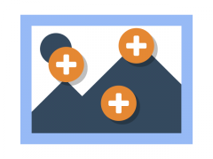

# Hotspots (Infographie réactive)

Ce contenu interactif permet de créer des infographies interactives : des "puces" sont réparties sur une image d'arrière plan ; un clic sur une de ces puces donne accès à des informations sous forme de textes, d'images ou de vidéos.

Il est ainsi possible d'enrichir n'importe quel document préexistant (enregistré sous forme d'une image) avec des points d'intérêt cliquables qui fournissent des informations sur certains détails représentés.

Nous commencerons par créer un contenu interactif de type "**Hotspots**".

